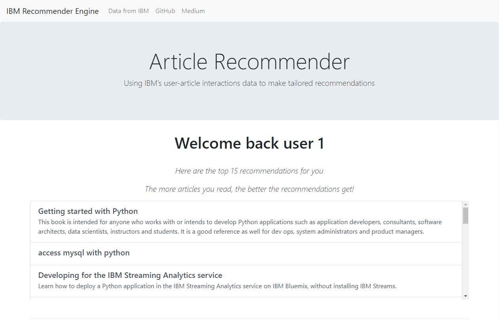

# ibm-recommendations

Analyzing user-article interactions data taken from the IBM Watson studio
to make tailored recommendations to users

## Motivation

IBM Watson Studio is home to a large set of curated articles, documents,
datasets and other resources related to the field of data science. These
resources are readily available to all users of the online platform. IBM 
requires a way to make these resources more personalized to individual
users in the form of tailored recommendations. Recommender systems are
used in commercial applications to make recommendations by predicting 
user ratings or preferences. The objective of this project is to develop
a client facing web application to query user data and to use server-side
scripting to generate tailored recommendations to clients. Application is
created in flask and sqlalchemy is used to update user-article interactions
on the webapp. Collaborative filtering (CF) and content based recommender
systems are used to make recommendations at the backend. Data is provided
by [IBM](https://dataplatform.cloud.ibm.com/home?context=wdp)

## Tech Stack

- python - scikit-learn, pandas, flask
- SQL - sqlite, sqlalchemy, object-relational mapper
- html, css, bootstrap, javascript

## Installation

These instructions will get you a copy of the project up and running on your local machine
for development and testing purposes. See deployment for notes on how to deploy the project
on heroku.

### Prerequisites

All dependencies for running the application on your local machine are listed in
requirements.txt. Make a new virtual environment and install the following
libraries inside this environment

```
flask
google
scikit-learn
pandas
numpy
nltk
sqlalchemy
```

### Installing

Clone the repository
```
git clone https://github.com/sameedakber-ai/ibm-recommendations-2.git
```

Create user-article interaction sqlite database
```
python data/process_data.py
``` 

Open python shell in main working directory and set up user database
```python
from app import db
db.create_all()
```

Run the WebApp
```
python app.py
```

Navigate to the http://127.0.0.1:5000 to access the application on your default browser

## Results





# Deployment

Login to heroku from command line
```
heroku login
```

Create a heroku app
```
heroku create your-unqie-package-name
```

Commit and push to heroku
```
git add .
git commit -m'your commit message here'
git push heroku master
```

Navigate to your heroku dashboard and open the app

## Built With

* [Flask](https://palletsprojects.com/p/flask/) - The web framework used
* [Heroku](https://dashboard.heroku.com) - Cloud Application Platform

## Authors

* **Sameed Akber** - *ibm-recommendations* - [sameedakber-ai](https://github.com/sameedakber-ai)

## License

Copyright 2019 Sameed Akber

Permission is hereby granted, free of charge, to any person obtaining a copy of this software and associated
documentation files (the "Software"), to deal in the Software without restriction, including without
limitation the rights to use, copy, modify, merge, publish, distribute, sublicense, and/or sell copies of
the Software, and to permit persons to whom the Software is furnished to do so, subject to the following
conditions:

The above copyright notice and this permission notice shall be included in all copies or substantial
portions of the Software.

THE SOFTWARE IS PROVIDED "AS IS", WITHOUT WARRANTY OF ANY KIND, EXPRESS OR IMPLIED, INCLUDING BUT NOT
LIMITED TO THE WARRANTIES OF MERCHANTABILITY, FITNESS FOR A PARTICULAR PURPOSE AND NONINFRINGEMENT. IN NO
EVENT SHALL THE AUTHORS OR COPYRIGHT HOLDERS BE LIABLE FOR ANY CLAIM, DAMAGES OR OTHER LIABILITY, WHETHER
IN AN ACTION OF CONTRACT, TORT OR OTHERWISE, ARISING FROM, OUT OF OR IN CONNECTION WITH THE SOFTWARE OR THE
USE OR OTHER DEALINGS IN THE SOFTWARE.

## Acknowledgements

[](https://www.udacity.com)

[](https://www.ibm.com/ca-en)